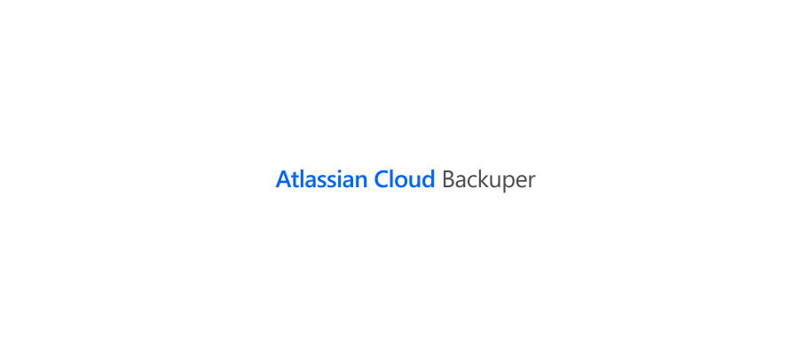

<p align="center"><a href="#readme"></a></p>

<p align="center">
  <a href="https://kaos.sh/y/atlassian-cloud-backuper"></a>
  <a href="https://kaos.sh/w/atlassian-cloud-backuper/ci"></a>
  <a href="https://kaos.sh/w/atlassian-cloud-backuper/codeql"></a>
  <a href="#license"></a>
</p>

<br/>

`atlassian-cloud-backuper` is tool for backuping Atlassian cloud services (_Jira and Confluence_).

### Installation

#### From [ESSENTIAL KAOS Public Repository](https://kaos.sh/kaos-repo)

```bash
sudo dnf install -y https://pkgs.kaos.st/kaos-repo-latest.el$(grep 'CPE_NAME' /etc/os-release | tr -d '"' | cut -d':' -f5).noarch.rpm
sudo dnf install atlassian-cloud-backuper
```

#### Prebuilt binaries

You can download prebuilt binaries for Linux from [EK Apps Repository](https://apps.kaos.st/atlassian-cloud-backuper/latest):

```bash
bash <(curl -fsSL https://apps.kaos.st/get) atlassian-cloud-backuper
```

#### Container Image

The latest version of `atlassian-cloud-backuper` also available as container image on [GitHub Container Registry](https://kaos.sh/p/atlassian-cloud-backuper) and [Docker Hub](https://kaos.sh/d/atlassian-cloud-backuper).

### Usage

#### Standalone


#### Container

If `atlassian-cloud-backuper` runs inside a container, it allows you to use united configuration (_knf file + options + environment variables_).


You can force output of this information by passing `container` to `--help` option:

```bash
atlassian-cloud-backuper --help container
```

### CI Status

| Branch | Status |
|--------|----------|
| `master` | [](https://kaos.sh/w/atlassian-cloud-backuper/ci?query=branch:master) |
| `develop` | [](https://kaos.sh/w/atlassian-cloud-backuper/ci?query=branch:develop) |

### Contributing

Before contributing to this project please read our [Contributing Guidelines](https://github.com/essentialkaos/contributing-guidelines#contributing-guidelines).

### License

[Apache License, Version 2.0](http://www.apache.org/licenses/LICENSE-2.0)

<p align="center"><a href="https://kaos.dev"></a></p>
